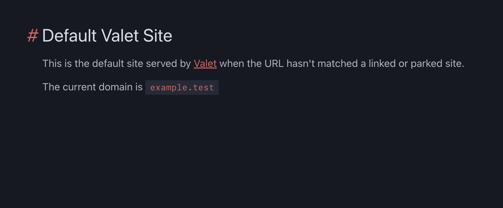

# Laravel Valet Default Site

Ever surf to a [Valet](https://laravel.com/docs/valet) site with a typo and see that ugly Nginx not found screen?

No need for that anymore.

You can use this 'default site' for Valet instead.

## Features

* Plain and Simple HTML and JS - No libraries or external dependencies
* Matches mostly the style of the Laravel documentation site
* Honors light and dark mode preferences in browser
* Renders the domain onto the screen in case there is some reason you can't see your address bar
* Just fancy... I mean - who does this?

## Installation Instructions

* Have [Valet](https://laravel.com/docs/valet) installed and up to date
* Git checkout this repo to a place that you'll remember for the next step: `git checkout git@github.com:aaronsaray/default-valet-site.git /Users/Sally/Sites/default-valet-site`
* Edit the `~/.config/valet/config.json` file to contain this key: `"default": "/Users/Sally/Sites/default-valet-site",`
